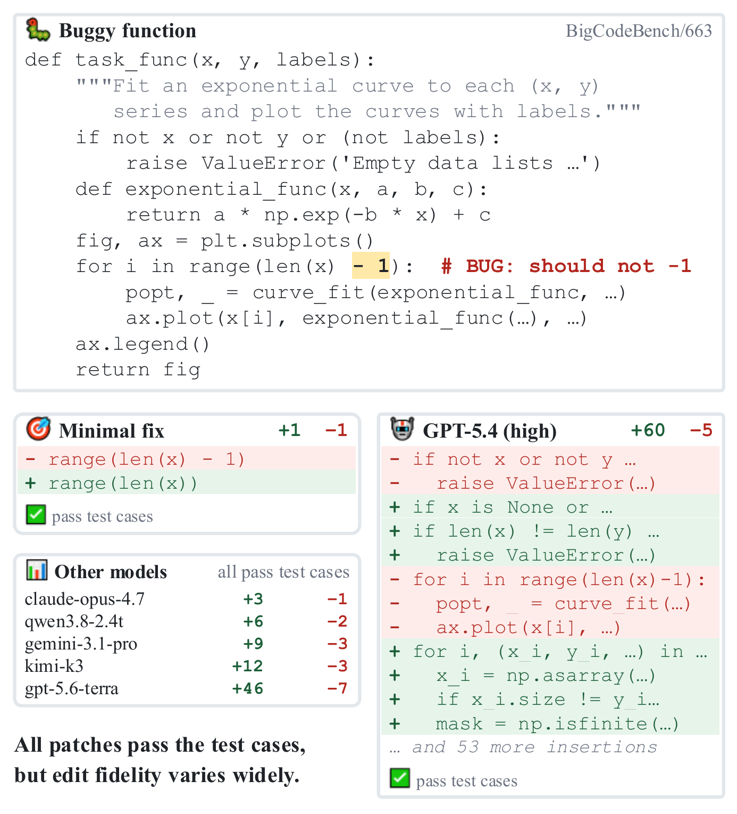
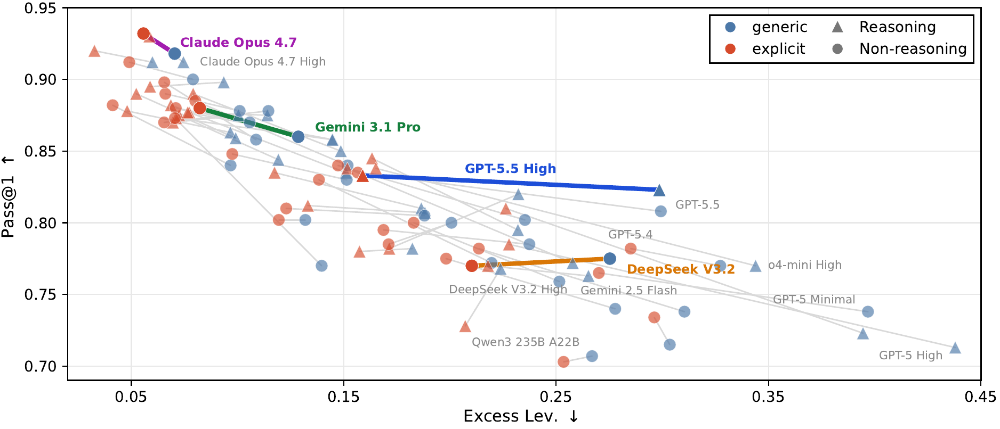
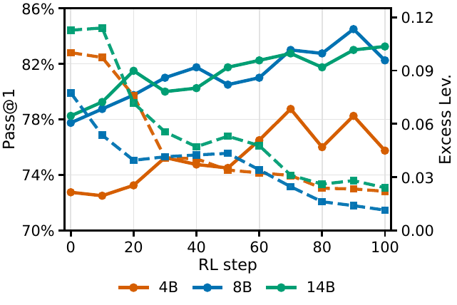
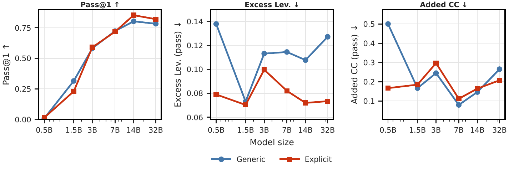

# 🩹 [EMNLP 2026] When Models Edit Too Much: On the Fidelity of Minimal Code Edits

Tongyao Zhu\*, Wei Hern Lim\*, and Min-Yen Kan<sup>†</sup>

<sub>National University of Singapore &middot; \*Equal contribution &middot; <sup>†</sup>Corresponding author</sub>

[](LICENSE)
[](pyproject.toml)
[](#citation-)

<!-- TODO(link): add an arXiv / ACL Anthology badge and URL here once the paper link is live. -->

<p align="center">
  
  <br>
  <sub>One off-by-one bug in a BigCodeBench function. The minimal fix changes a single line; GPT-5.4 adds 60 lines of validation, dtype coercion, NaN masking, and resampling that no test requires. Every patch shown passes all five tests — edit fidelity is what separates them.</sub>
</p>

This repository accompanies our EMNLP 2026 main conference paper, *When Models Edit Too Much: On the Fidelity of Minimal Code Edits*. 🔧

LLMs are increasingly asked to edit code that already exists. Correctness alone is not enough there: a good repair should also be **minimal, reviewable, and faithful** to the original implementation. We study **over-editing** — a functionally correct repair that changes more code than the minimal fix requires. 🐛

To measure it, we need to know what the minimal repair *is*. So we build one: starting from 400 BigCodeBench problems, we inject localized AST-level corruptions into each reference solution and keep the example only if the corrupted program fails the original tests. The minimal repair is then known by construction — it is exactly the reversal of the injected corruption. 🎯

We score every repair on three axes:

| Metric | What it captures |
| --- | --- |
| **Pass@1** | Functional success on the original BigCodeBench tests. |
| **Excess Levenshtein distance** | Edit size beyond the minimum: normalized token-level distance from the model's repair to the buggy program, minus the same distance for the reference repair. |
| **Added cognitive complexity** | Structural overhead — control-flow complexity the model added that the minimal fix does not need. |

## Main Results 🔎

| Question | What we find |
| --- | --- |
| 🤖 Do frontier models over-edit? | Yes, and correctness does not predict it. GPT-5.5, DeepSeek, and Gemini variants reach competitive Pass@1 while changing far more code than the minimal reversal. Claude Opus 4.7 shows the two *can* coexist. |
| 💬 Does one sentence help? | Substantially. Adding a single preservation clause drops aggregate excess Levenshtein distance from **0.195 → 0.131**, cuts added cognitive complexity by **26.6%**, and *raises* Pass@1 by **2.3 points** (matched-pair signed-rank *p* < 10⁻⁴). It shifts all 50 model-prompt settings toward smaller edits and lifts Pass@1 in 40 of 50. |
| 🧠 Is reasoning enough? | No. Reasoning effects are model-specific rather than monotonic — it helps some families on both metrics and hurts others. |
| 📈 Is scale enough? | No. Across Qwen2.5-Coder 0.5B→32B, Pass@1 rises with size but edit fidelity does not improve monotonically. |
| 🔓 Open-weight models too? | Same pattern. Preservation prompting moves average Pass@1 0.788 → 0.828 and excess Levenshtein 0.176 → 0.121. |
| 🎓 Can minimal editing be learned? | Yes — best with RL. SFT nearly solves in-domain but collapses out-of-domain; RL holds correctness, shrinks patches, and does not degrade LiveCodeBench. |
| 🔍 Which bugs trigger it? | Ambiguous one-token bugs. Slice bounds (0.874 Pass@1 but 0.353 excess Lev.) and list indexing read to the model as missing preconditions rather than a typo. |

<p align="center">
  
  <br>
  <sub>Each connected pair is one model under the generic (blue) and explicit preservation (red) prompt; four families are highlighted. Up and to the left is better. The heaviest over-editors move furthest — GPT-5.5 High nearly halves its excess distance (0.299 → 0.159) — while the already-faithful Opus 4.7 barely moves.</sub>
</p>

**Minimal-edit post-training** on Qwen3-4B-Instruct-2507. Pass@1 is over all 400 evaluation examples; edit metrics are averaged over passing repairs. LCB is the absolute LiveCodeBench v6 score, with the change from the base model (32.6%) in parentheses.

| Method | ID Pass@1 ↑ | ID Excess Lev. ↓ | ID Added CC ↓ | OOD Pass@1 ↑ | OOD Excess Lev. ↓ | OOD Added CC ↓ | LCB (%) ↑ |
| --- | --- | --- | --- | --- | --- | --- | --- |
| SFT | 0.932 | 0.002 | 0.000 | 0.458 | −0.008 | 0.006 | 17.7 (−14.9) |
| rSFT | 0.782 | 0.100 | 0.435 | 0.780 | 0.107 | 0.501 | 25.7 (−6.9) |
| DPO | 0.752 | 0.021 | 0.113 | 0.787 | 0.092 | 0.348 | 28.0 (−4.6) |
| **RL** | 0.802 | 0.046 | 0.112 | 0.782 | **0.050** | **0.185** | **33.2 (+0.6)** |

SFT's in-domain numbers look excellent and mean little: its out-of-domain Pass@1 falls to 0.458, so its edit metrics describe only the shrinking subset that still passes. RL is the only method that improves edit fidelity *and* keeps broader coding ability intact.

<p align="center">
  
  
  <br>
  <sub>Left: across 4B–14B, RL steadily reduces excess edits while preserving Pass@1. Right: scale raises Pass@1 but does not monotonically improve edit fidelity.</sub>
</p>

## What You Will Find Here 📦

```text
partial_edits/          Benchmark construction, generation, and evaluation pipeline
  utils/                Corruption, extraction, similarity, and prompt helpers
  ui/                   Standalone HTML viewer for inspecting evaluation results
models/                 Provider interfaces (OpenRouter, OpenAI-compatible, Anthropic, Google, Qwen)
evaluator/              Dockerized sandbox that executes BigCodeBench tests
data/questions/         The 400-task corrupted evaluation set
train/                  Post-training: SFT/DPO configs, PRIME-RL environment, LiveCodeBench fork
assets/figures/         Paper figures shown above
```

Generated artifacts (`data/code_edits/`, logs, checkpoints) are gitignored to keep the repo lightweight; the evaluation set under `data/questions/` is tracked explicitly.

## The Evaluation Set 📋

`data/questions/corrupted_solutions_manual_easy_400.jsonl` is the 400-task set used for the evaluation runs in the paper:

- **400 BigCodeBench tasks**, each with one or two injected corruptions — 232 tasks carry one and 168 carry two, for 568 corruption applications in total.
- **12 corruption families** appear, led by edge-case guards (129), arithmetic operators (104), comparison operators (75), numeric constants (64), and range bounds (60).
- Each record has `task_id`, `prompt`, `canonical_solution`, `corrupted_solution`, and `test_code`. Note that the corruption labels live under **`mutation_type`** in 172 records and **`mutation_types`** in the other 228 — read both keys when parsing.

## Reproduce The Main Run 🚀

Install [uv](https://docs.astral.sh/uv/) and sync the environment:

```bash
curl -LsSf https://astral.sh/uv/install.sh | sh
source ~/.bashrc
uv sync
```

Set the API key for the provider you are querying (generation routes through [OpenRouter](https://openrouter.ai/) by default) — a `.env` file at the repo root is picked up automatically:

```bash
export OPENROUTER_API_KEY=...
```

**Step 1 — generate repairs.** This is the paper's *generic* condition; results are written to `data/code_edits/zero_shot_generic/`:

```bash
uv run partial_edits/generate_solutions.py \
  --questions_path data/questions/corrupted_solutions_manual_easy_400.jsonl \
  --model <MODEL_NAME> \
  --generic \
  --store_token_info
```

`--generic` is not optional here — it selects the system prompt every reported run used. See [Prompt Conditions](#prompt-conditions-) before changing it.

**Step 2 — start the execution sandbox.** Tests run inside Docker, never on the host. Build from the `evaluator/` directory, since the image copies its build context:

```bash
cd evaluator
docker build -t code-evaluator .
docker run -d --name code-evaluator -p 8000:8000 code-evaluator
cd ..
```

**Step 3 — evaluate.** This executes the tests and computes the edit-fidelity metrics:

```bash
uv run partial_edits/evaluate.py \
  --sample_path data/code_edits/zero_shot_generic/results_<MODEL_NAME>_non_reasoning_400.jsonl \
  --eval_similarity
```

`evaluate.py` parallelises test execution but computes the similarity metrics single-threaded, so raising `--max_workers` past a handful gives diminishing returns.

### Prompt Conditions 🗣️

The two prompt settings compared throughout the paper map onto flags as follows. The naming is a trap worth reading twice:

| Paper condition | How to run it | Request the model sees |
| --- | --- | --- |
| **Generic** | `--generic` | *What is wrong? Fix and complete my function.* |
| **Explicit** (preservation) | `--generic --is_explicit` | *What is wrong? Fix and complete my function **but keep as much of the original code as possible**.* |

Both conditions use the **same** system prompt — the one that states the repair task and the signature/docstring constraint without mentioning preservation. That prompt is the one `--generic` selects, so **pass `--generic` in both conditions**; `--is_explicit` is what switches generic → explicit.

Omitting `--generic` is the trap: it swaps in a different system prompt that *already* asks the model to preserve the original code, which is not the configuration the reported runs used.

Other useful flags: `--is_reasoning` selects the reasoning variant of a model, `--include_test_cases` shows the tests to the model, and `--num_shots` / `--shots_file_path` enable few-shot prompting.

## Where To Go Next 🧭

| If you want to... | Go here |
| --- | --- |
| Inspect evaluation results in a browser | [`partial_edits/ui/code_viewer.html`](partial_edits/ui/code_viewer.html) |
| See how corruptions are injected | [`partial_edits/corrupt_data_manual.py`](partial_edits/corrupt_data_manual.py) and [`partial_edits/utils/code_corruptor.py`](partial_edits/utils/code_corruptor.py) |
| Understand the edit-fidelity metrics | [`partial_edits/utils/similarity_utils.py`](partial_edits/utils/similarity_utils.py) and [`partial_edits/utils/extract_utils.py`](partial_edits/utils/extract_utils.py) |
| Add or change a model provider | [`models/__init__.py`](models/__init__.py) |
| Run SFT, DPO, or RL | [`train/README.md`](train/README.md) |
| Evaluate on LiveCodeBench | [`train/LiveCodeBench/`](train/LiveCodeBench) |

## Notes On This Release 📝

- **Trained checkpoints and raw result files are not part of this release yet.** The code here reproduces the benchmark, the prompting experiments, and the training pipeline; the model artifacts will follow.
- **Generation routes through OpenRouter.** In [`models/__init__.py`](models/__init__.py), the provider-specific and `local/` (vLLM) branches of `get_model` are commented out, so serving an open-weight model from a local endpoint needs that routing re-enabled.
- **`train/LiveCodeBench/` is a vendored fork** of [LiveCodeBench](https://github.com/LiveCodeBench/LiveCodeBench), which fixes several upstream bugs and adds model support. It keeps its own MIT `LICENSE` and is not covered by this repository's Apache-2.0 license.

## Acknowledgements 🙏

We thank the members of [WING@NUS](https://wing.comp.nus.edu.sg/) for their feedback throughout this project, and Prime Intellect for sponsoring the compute and API costs.

## Citation ✍️

If this code is useful for your research, please cite our EMNLP 2026 paper:

```bibtex
@inproceedings{zhu2026whenmodelsedit,
  title     = {When Models Edit Too Much: On the Fidelity of Minimal Code Edits},
  author    = {Zhu, Tongyao and Lim, Wei Hern and Kan, Min-Yen},
  booktitle = {Proceedings of the 2026 Conference on Empirical Methods in Natural Language Processing},
  year      = {2026},
  note      = {To appear}
}
```
<!-- TODO(link): replace `note = {To appear}` with the ACL Anthology pages/url once assigned. -->

## License 📄

This repository is released under the [Apache-2.0](LICENSE) license, except for `train/LiveCodeBench/`, which retains its upstream MIT license.
